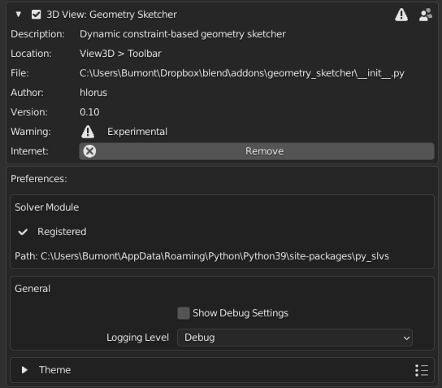
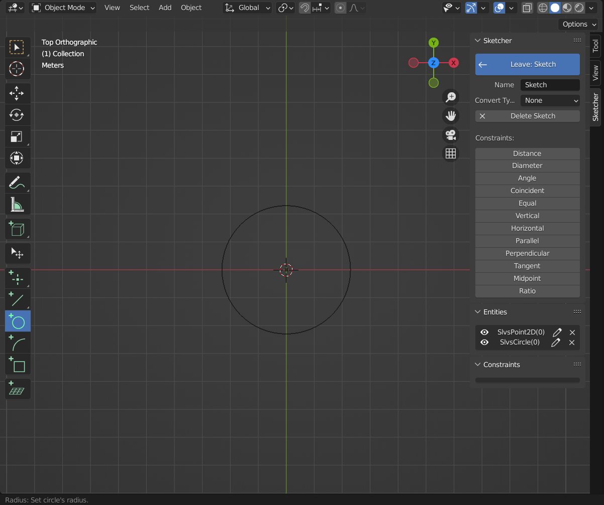
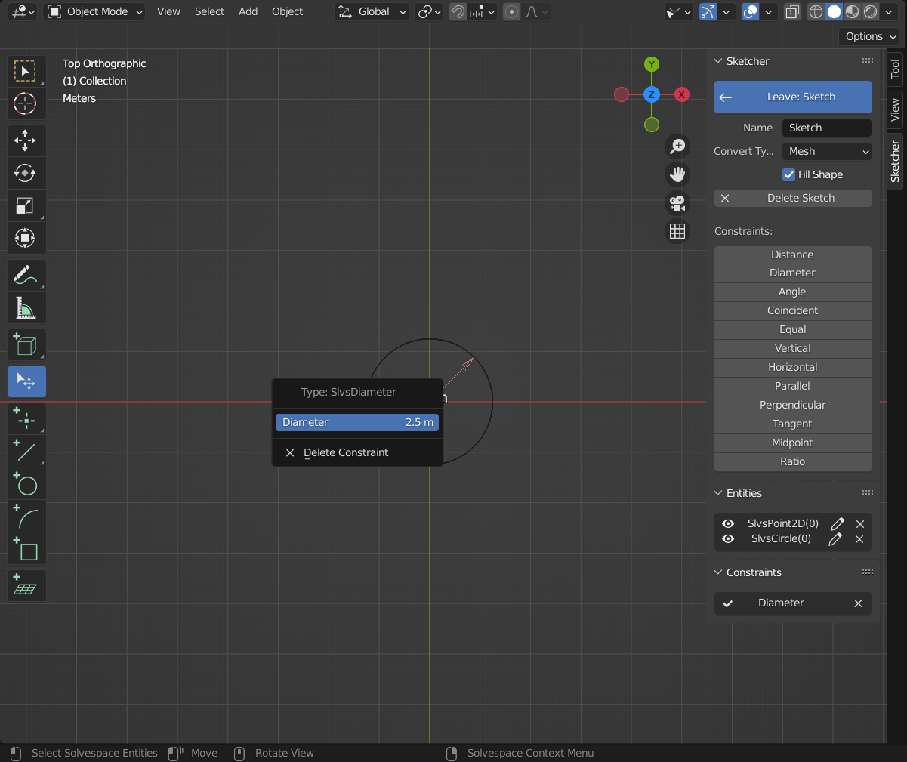

This guide takes you through the first steps in order to get familiar with the extension.

## Installation
{style="width:100%; height:200px; object-fit:cover;"}

Download the [Latest Release](https://github.com/hlorus/CAD_Sketcher/releases)
of the extension and install it from the "Get Extensions" tab in blender's preferences.
See the [installation guide](installation.md) if
you have trouble installing the extension.

## Create a Sketch
{style="width:100%; height:200px; object-fit:cover;"}

In the 3d Viewport open the sidebar (you can show it from the menu view->sidebar or by pressing the 'N' key) and change to the "Sketcher" tab. Press the
button  "Add Sketch" and pick one of the origin planes that appears. The newly
created sketch will then be activated and any geometry that is drawn will belong
to it. The sketch can be exited and re-activated at any time by simply pressing
the "Leave Sketch" button.

## Add some Geometry
{style="width:100%; height:200px; object-fit:cover;"}

While a sketch is active switch to the "Add Circle" Workspacetool. Now hover the
sketch's origin point, click it and move the mouse away, click again to confirm.

## Add Constraints
{style="width:100%; height:200px; object-fit:cover;"}

Switch back to the [Selection Tool](user_interface.md#select-tool), by pressing ESC.
Make sure nothing is selected by pressing ESC again or by clicking into empty space
while the selection tool is active. Now select the circle and click the button
in the sidebar to add a diameter constraint.

## Convert
{align=left style="display:inline-block; width:30%; height:200px; object-fit:cover;"}
{align=right style="display:inline-block; width:calc(70% - 2em); height:200px; object-fit:cover;"}

While the sketch is still active, select a convert method from the sidebar, then
exit the sketch.

## Edit and Update
{align=left style="display:inline-block; width:calc(50% - 1em); height:200px; object-fit:cover;"}
{align=right style="display:inline-block; width:calc(50% - 1em); height:200px; object-fit:cover;"}

Re-activate the sketch from the [sketch selector](user_interface#sketch-selector).
Click the diameter constraint and enter a value. Switch to the rectangle tool and draw
a rectangle around the circle.

## Add Dimensions
{align=left style="display:inline-block; width:calc(50% - 1em); height:200px; object-fit:cover;"}
{align=right style="display:inline-block; width:calc(50% - 1em); height:200px; object-fit:cover;"}

Now also give the rectangle exact dimensions by selecting a line and a point on the
opposite side and clicking the distance button in the sidebar. Do that again for in
the other direction.

## Add Construction Geometry
{align=left style="display:inline-block; width:calc(50% - 1em); height:200px; object-fit:cover;"}
{align=right style="display:inline-block; width:calc(50% - 1em); height:200px; object-fit:cover;"}

Note that the rectangle still hasn't a defined position. To fix that add a line between
two edge points, mark it as construction and add a midpoint constraint between that
line and the sketch origin.
