This guide takes you through the first steps in order to get familiar with the extension.

## Installation
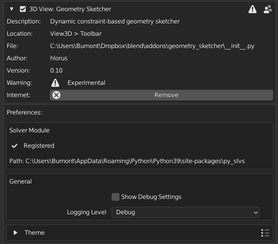{style="width:100%; height:200px; object-fit:cover;"}

Download the [Latest Release](https://github.com/hlorus/CAD_Sketcher/releases)
of the extension and install it from the "Get Extensions" tab in blender's preferences.
See the [installation guide](installation.md) if
you have trouble installing the extension.

## Create a Sketch
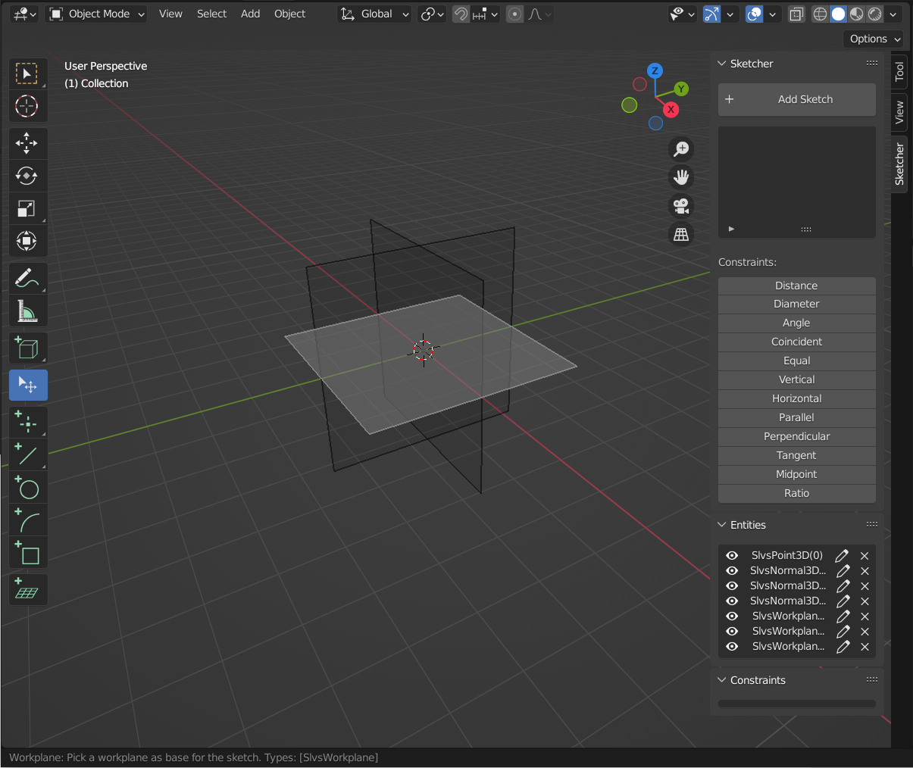{style="width:100%; height:200px; object-fit:cover;"}

In the 3d Viewport open the sidebar (you can show it from the menu view->sidebar or by pressing the 'N' key) and change to the "Sketcher" tab. Press the
button  "Add Sketch" and pick one of the origin planes that appears. The newly
created sketch will then be activated and any geometry that is drawn will belong
to it. The sketch can be exited and re-activated at any time by simply pressing
the "Leave Sketch" button.

## Add some Geometry
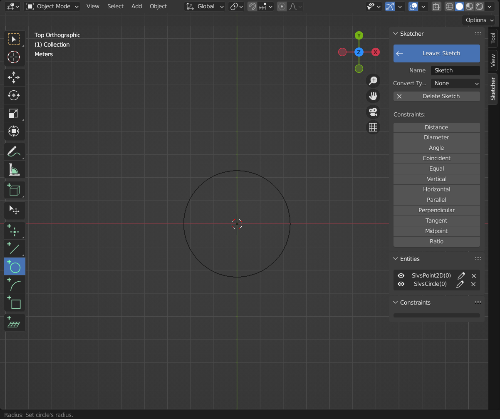{style="width:100%; height:200px; object-fit:cover;"}

While a sketch is active switch to the "Circle" Workspacetool. Now hover the
sketch's origin point, click it and move the mouse away, click again to confirm.

## Add Constraints
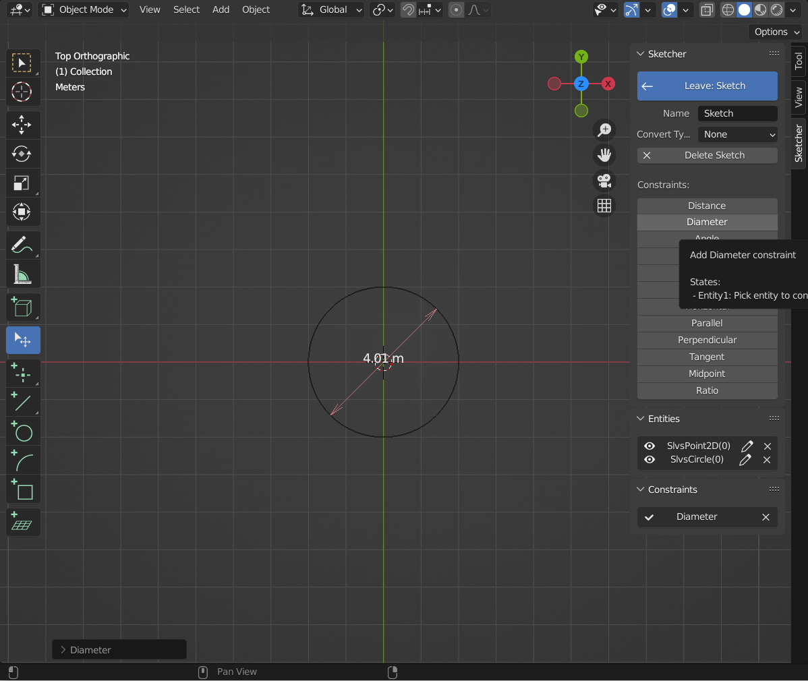{style="width:100%; height:200px; object-fit:cover;"}

Switch back to the [Selection Tool](user_interface.md#select-tool), by pressing ESC.
Make sure nothing is selected by pressing ESC again or by clicking into empty space
while the selection tool is active. Now select the circle and click the diameter
button in the sidebar's "Constraints" section to add a diameter constraint (the
buttons show as icons by default, hover one for its name).

## The Result
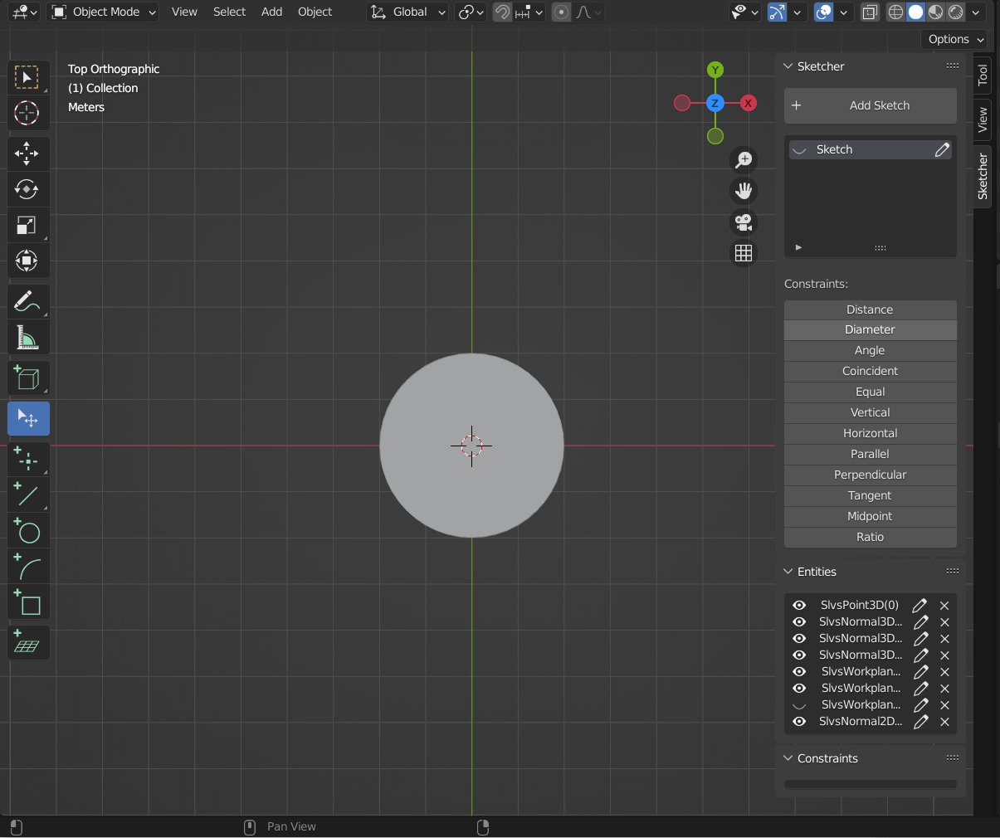{align=right style="display:inline-block; width:calc(70% - 2em); height:200px; object-fit:cover;"}

The geometry you draw is realised on the sketch's
<b>body</b>, a normal mesh object that follows the sketch as you edit it. Exit the
sketch to see it on its own.

The body carries a **CAD Sketcher Convert** modifier, where **Fill** decides
whether closed shapes are surfaced and **Angular Resolution** how finely arcs and
circles are meshed. Everything you add later, an extrude or a boolean, stacks on
top of it, see [integration](integration.md).

## Edit and Update
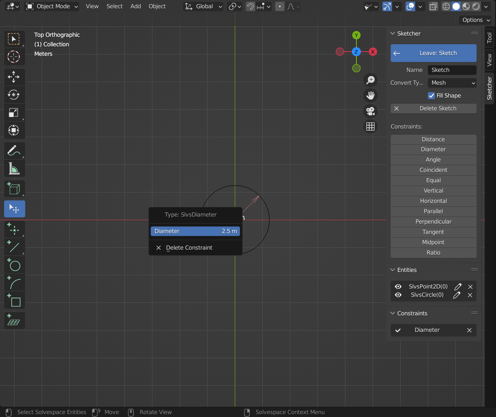{align=left style="display:inline-block; width:calc(50% - 1em); height:200px; object-fit:cover;"}
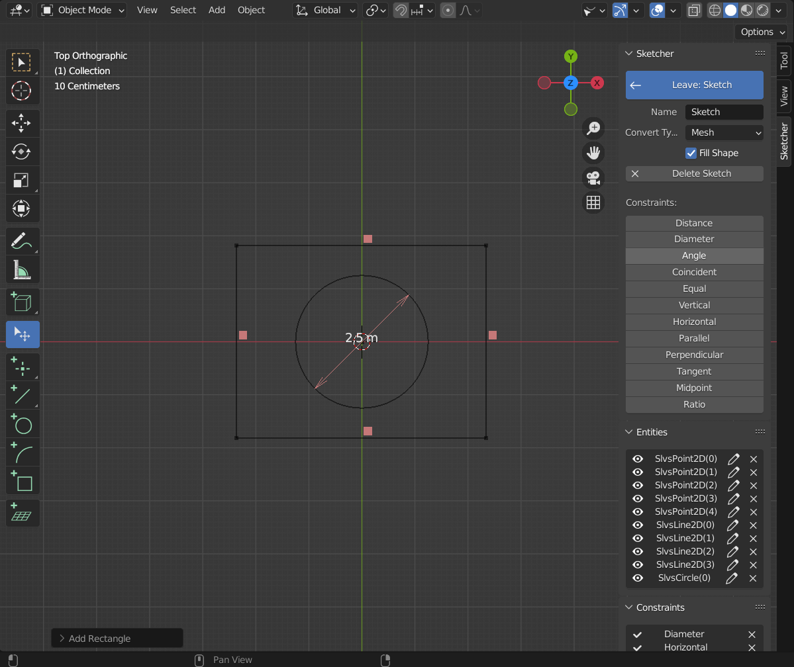{align=right style="display:inline-block; width:calc(50% - 1em); height:200px; object-fit:cover;"}

Re-activate the sketch from the [sketch selector](user_interface#sketch-selector).
Click the diameter constraint and enter a value. Switch to the rectangle tool and draw
a rectangle around the circle.

## Add Dimensions
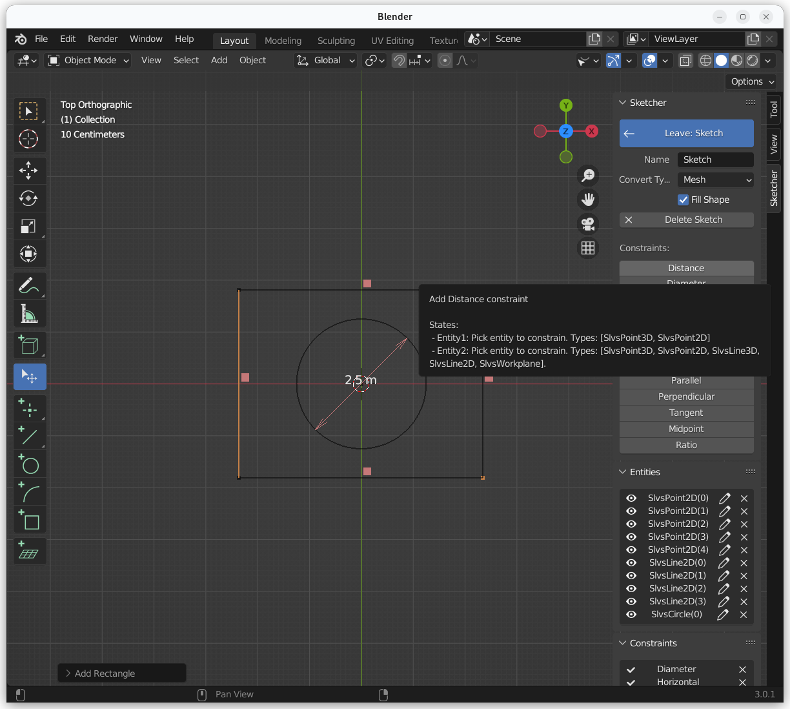{align=left style="display:inline-block; width:calc(50% - 1em); height:200px; object-fit:cover;"}
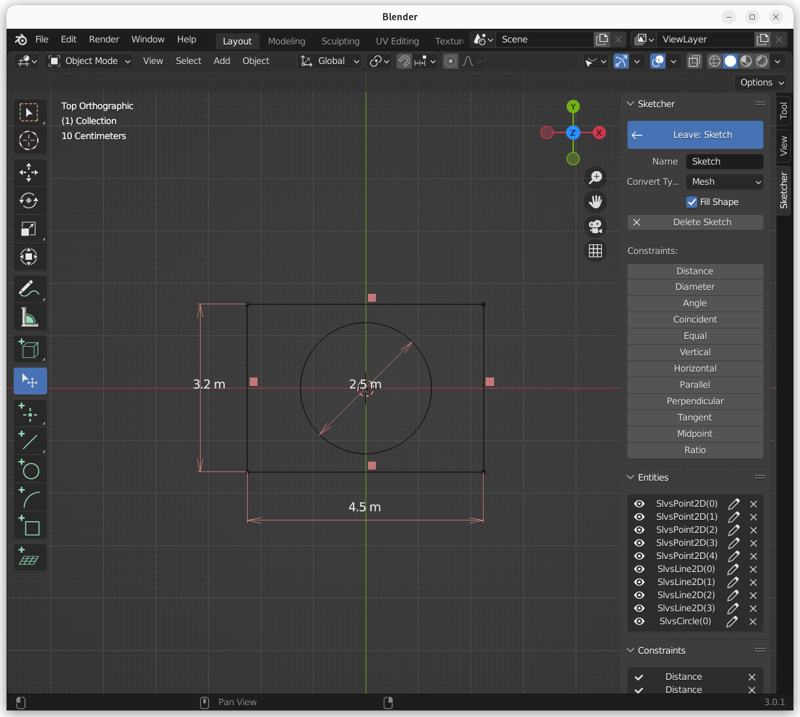{align=right style="display:inline-block; width:calc(50% - 1em); height:200px; object-fit:cover;"}

Now also give the rectangle exact dimensions by selecting a line and a point on the
opposite side and clicking the distance button in the sidebar. Do that again for in
the other direction.

## Add Construction Geometry
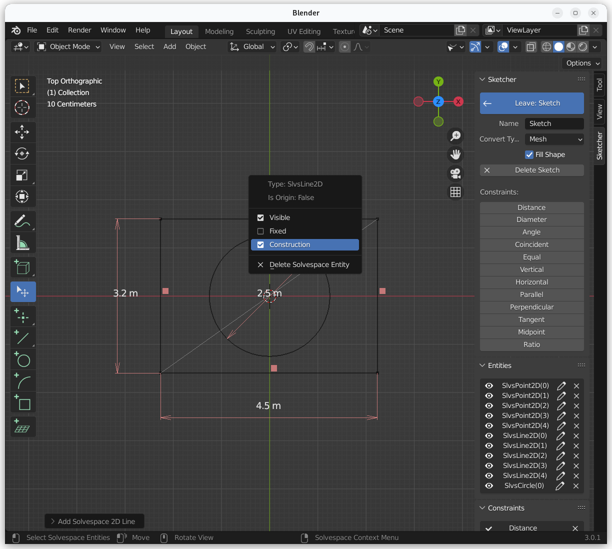{align=left style="display:inline-block; width:calc(50% - 1em); height:200px; object-fit:cover;"}
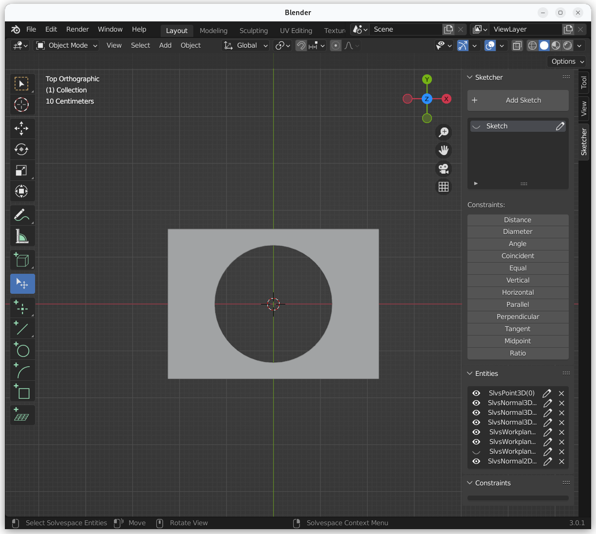{align=right style="display:inline-block; width:calc(50% - 1em); height:200px; object-fit:cover;"}

Note that the rectangle still hasn't a defined position. To fix that add a line between
two edge points, mark it as construction and add a midpoint constraint between that
line and the sketch origin.
