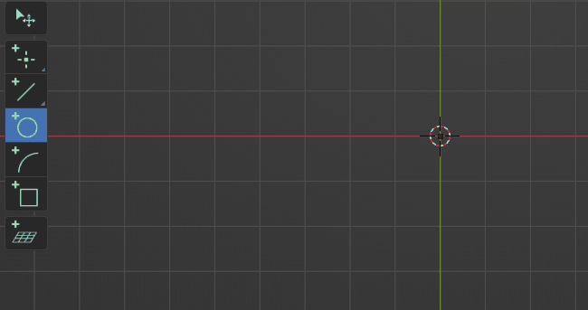
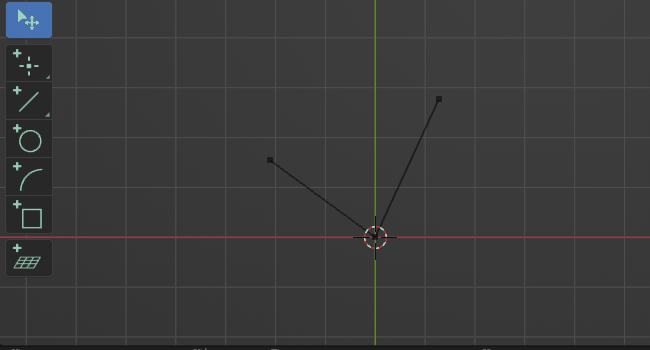
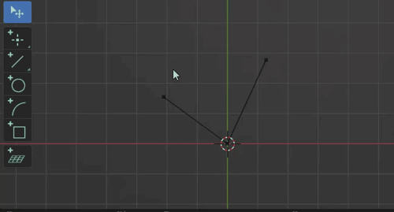
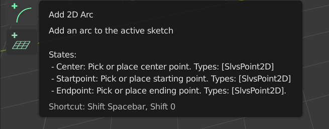
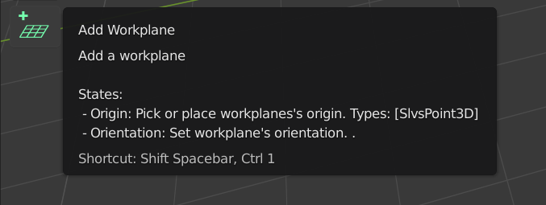
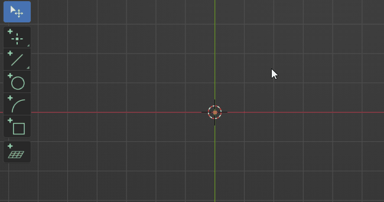

The focus of the extension lies on different aspects than blender itself. Extension tools usually work on one specific entity or between a few entities where the order of
selection matters. As the existing system of selection isn't ideal in this context the extension defines a generic interaction system which allows for a powerful and flexible workflow.

## Stateful Operations

Most tools in the extension are implemented as stateful tools. In this context a state represents one target like a selection or a value. When running a tool you will iterate through these states until all states have valid input.

Let's take the "Add Circle" tool as an example. Since a circle is represented by its center and radius the tool will have two states. One to define the center element and one to set the radius.

### State Types

A state can have two different kind of targets:

- Pointer

  A pointer target is best described as a selection. Pointer states will prompt the user to select an element of the according type.

- Property

  A property target simply represents a value of some kind like an integer or a float  or a set of values to represent something like a location.

{align=right style="width:50%"}
A state can however define both of those targets. In that case the property will be used to create a new element to satisfy the pointer target. This is often used to be able to place a new point at the mouse location when nothing is hovered but pick an existing point if one is hovered.

### Selection vs Action
To be as flexible as possible the interaction system allows to work in different paradigms which can also be freely mixed. Those are:

- Select -> Invoke Operation
  (The standard way to work in blender)
{style="width:100%;height:200px; object-fit:cover;"}

- Invoke Operation -> Select
{style="width:100%;height:200px; object-fit:cover;"}

- Partial Select -> Invoke Operation -> Select rest (Or set Parameters)
{style="width:100%;height:200px; object-fit:cover;"}

### Numerical Edit
In order to precisely edit a states property, it's possible to edit values directly by entering numbers. When the stateproperty is a set of multiple values (e.g. XYZ Location) they will be treated as sub-states, meaning you can iterate (TAB) through them and enter values sequentially.

### Description
When learning how a new tool works it's best to take a look at its tooltip, this will list the different states of the tool. For pointer states this will additionally display the accepted types that can be picked.

{align=left style="height:160px; width:calc(50% - 1em); object-fit:cover;"}

{align=right style="height:160px; width:calc(50% - 1em); object-fit:cover;"}

While running an operation the statusbar will display that information for the currently active state.

### Immediate Execution
Most tools support immediate execution which will invoke the tools operations when switching to it and a valid
selection is given.
>Note that the execution is only triggered when a tool is invoked by its shortcut.

{style="width:100%;height:200px;object-fit:cover;"}
