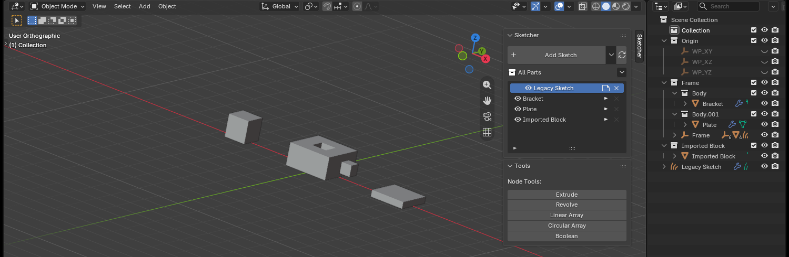
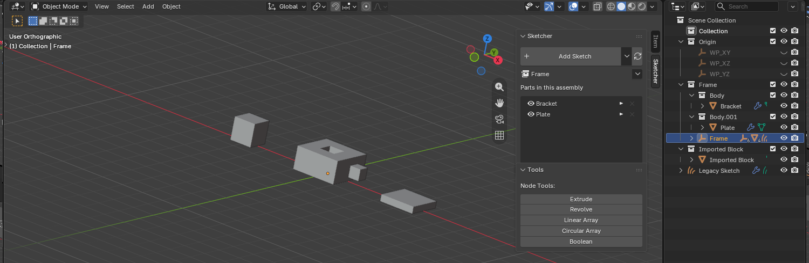
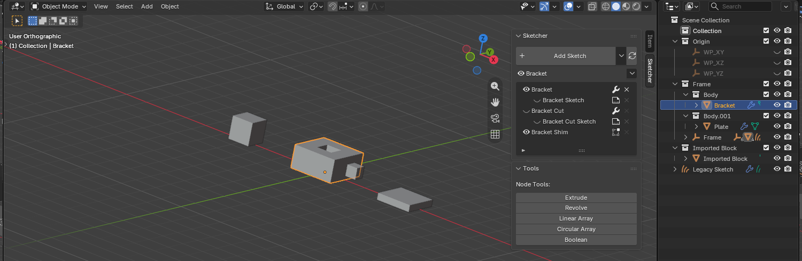
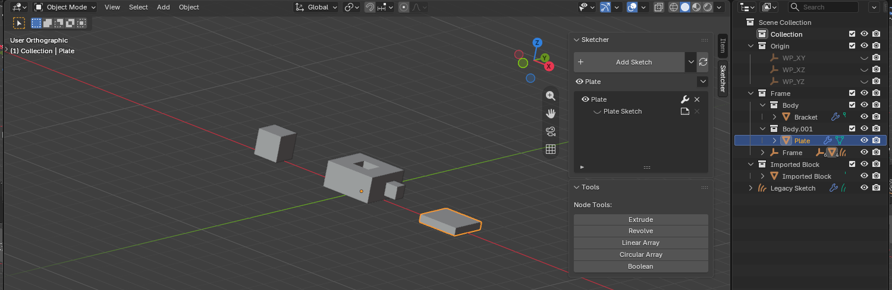
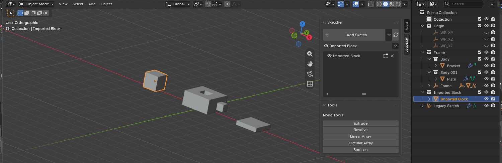
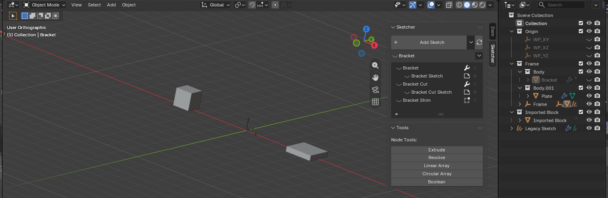

# Parts and Assemblies

A **part** is one thing you can move: a body together with the sketches and
workplanes that define it. The body is a real mesh object, and each sketch stays
pure source whose geometry is realised on it, which is why a part exports,
applies and edits like any other mesh.

An **assembly** is a group of parts you can move as a whole. Both are just object
parenting, so the outliner shows the real structure and you edit it there.

## In the outliner

The outliner is where parts live. It shows two things at once: collections group
each part, and objects nest under the object that carries them.

- **Scene Collection**
    - **Origin** &mdash; the shared XY / XZ / YZ datum planes
    - **Bracket** &mdash; an assembly collection
        - **Plate** &mdash; a part collection
            - **Plate** &mdash; the part's body: a mesh, carrying the features
                - **Plate XY** &mdash; the plane its sketch was drawn on, now the part's XY
                    - **Plate Sketch** &mdash; the source the body is built from
                - **Plate XZ**, **Plate YZ** &mdash; made when the picker first offered them
                - **Workplane** &mdash; on a face of Plate
                    - **Plate.001** &mdash; a cutter, with its own sketch beneath it
        - **Pin** &mdash; a second part in the same assembly
    - **Body** &mdash; global: drawn on a datum, not yet solid
        - **Body Workplane** &mdash; its own plane, nameless until it becomes a part

A new body is called **Body**, or takes the name of the part it joins, and its
plane and sketch follow the name it has: rename the body and they rename with
it.

Read the nesting, not the collections: **`Plate.001` is part of `Plate` because
it hangs under it**, through the workplane it sits on. The collections follow that
structure, they do not define it. Moving `Plate` moves everything beneath it;
moving `Bracket` moves both parts.

This is also why parenting is how you change membership: `Shift`-drag `Body`
onto `Plate` and it becomes one of its features. A plain drag only moves an
object between collections, which changes nothing.

## The part list

The Sketcher panel lists what you are working on. What it holds follows the
active object, so the list is a view of one part rather than of the whole file.

Above the list sits the part itself: whether it is shown, its name, and a menu
holding everything that acts on the whole of it. That row is always there, so the
menu is also where a part is made in the first place.

Every eye in the panel shows exactly the thing on its own row, so hiding a part,
hiding one feature of it and hiding a sketch are three separate controls.

### Every part in the file

With nothing selected the list shows the parts, plus anything that belongs to no
part. A row here stands for a whole part, so its eye shows or hides the part, and
its button opens the part rather than one of its sketches: a part holds many, so
there is nothing single to open.

### One assembly

Select an assembly and the list narrows to the parts inside it.

### One part

Select a part and the list shows what it is made of, the feature it was built
from first, then everything added on top. Each feature takes two rows: the
feature itself, and indented beneath it the sketch it was drawn from.

Two rows because they are two different things to show or hide. The eye on a
feature is its solid; the eye on the sketch beneath it is the profile it was
drawn with. Neither has to stand in for the other.

| Row | The eye shows | Opens |
|---|---|---|
| A feature | Its solid. A cutter is hidden while it cuts, so there the eye brings it back as a wireframe | What it was made with: its extrude or revolve, and the boolean that applies it |
| Its sketch | The sketch's own curves | The sketch, for editing |

The cross deletes the feature, both rows at once, so the sketch row has none of
its own. On the row the part was built from it deletes the whole part, since a
part cannot lose the feature it stands on.

A cutter is hidden while it cuts, so the viewport is no way to reach one. Its row
is.

A part that has only been made solid once has the one feature, and so one pair of
rows.

### Editing a feature

The wrench on a feature's row opens what that feature was made with: the size of
an extrude, the angle of a revolve, whether a cut is a difference or a union, and
which solver it uses.

A boolean lives on the body being cut rather than on the cutter, so a cutter's
own modifier stack does not hold it. The wrench gathers both, and says which
body each one sits on, so a cut can be adjusted from the row that made it.

### A part that was never drawn

Imported geometry made a part by hand has no sketch, so there is no second row
and nothing to open for editing. Its row opens Blender's Edit Mode instead, where
its mesh is the geometry itself.

### A hidden part

Hiding a part hides everything in it. The part stays in the panel, so the same
eye brings it back.

### From the viewport

Right-click a part and **Edit Sketch** opens the sketch that made it. When the
part holds several you get them as a menu, body first.

## Moving a part

Leave the sketch (parts are moved in Object Mode), select the part's body, the
mesh, and press `G` or `R`. Its sketches, workplanes and cutters follow. Scale is
locked:
the solver treats a sketch's plane as a rigid frame, so a scaled part would draw
and solve at different sizes.

The object you grab is the body, so you are moving the geometry you see rather
than a helper object. The sketches that shape it are pinned within it.

## What belongs to what

Membership is never a mode you switch. It follows from what you drew on, and it
is settled when the sketch becomes solid:

| You do this | Result |
|---|---|
| Sketch on a body's face or on a part's workplane | Joins that part right away |
| Sketch on a global XY/XZ/YZ plane | Stays **global**: no part, free to move |
| Extrude or revolve with nothing to cut | Its body roots a part of its own |
| Extrude or revolve that cuts an existing body | Joins that body's part, as a cut feature |
| Editing what a body is made of | Edit its sketch; the body follows |
| A cut reaching bodies in several parts | Belongs to no part; if those parts share an assembly it becomes a feature of the assembly |

A cut has to travel with the body it cuts, which is why it joins that part: were
it left behind, moving the body would silently change the result.

## Making a part by hand

Parts normally appear on their own, but imported geometry never passes through a
sketch tool. Select it and use **Make Part** from the Part menu: the active
object roots the part and anything else selected joins it. With a part already
active it simply takes the rest of the selection in, which is how you add a body
to an existing part.

That menu is the arrow above the part list, and it is also on the right-click
menu in the viewport and in the outliner. It carries everything that acts on a
whole part: making one, grouping parts into an assembly, copying and placing one,
taking something back out, and deleting.

## Part workplanes

A sketch that is not in a part sits on a plane of its own, where you drew it.
When it becomes solid, that same plane becomes the new part's **XY**: a part's XY
is always the plane its first sketch was drawn on, and XZ and YZ appear the first
time the picker offers them.

Select a part and the Add Sketch tool shows its planes, drawn smaller, *in place
of* the scene's, so a part that has been moved or rotated is sketched in its frame
rather than the world's. Deselect to get the scene's planes back, which is also
how you start a new part.

Sketching on a face makes a workplane for that face, and you can sketch on any
empty you place yourself. Those are the only other planes: nothing creates a
plane per sketch.

## Changing membership by hand

Parenting **is** membership, so the override is Blender's own gesture: `Ctrl+P`
in the viewport, or `Shift`-drag in the outliner (a plain drag there moves an
object between collections instead, which decides nothing).

- Parent a sketch onto a part's body to make it a feature of that part.
- Unparent it (`Alt+P`) to make it global again.
- Parent a part onto an assembly root to put it in that assembly.

A sketch that becomes a feature is pinned in place; one that leaves a part is
free to move again. Objects you made yourself keep their freedom either way.

The Part menu says the same thing in words, and frees what it takes out so you
can move it again:

- **Remove from Part** takes the active object out, leaving it where it stands.
  On a part that sits in an assembly it reads **Remove from Assembly**.
- **Dissolve Part** takes a whole part apart and keeps every object in it. It is
  the opposite of Make Part. An assembly dissolves the same way, and its root,
  which held nothing of its own, goes with it.

## Deleting

Blender's own Delete takes the object you clicked and nothing else, which on a
part leaves the rest behind: the cutters that shaped it survive, and the part
lives on rooted in one of them. The Part menu deletes whole things instead:

- **Delete Feature** takes one step off a part: the solid, the sketch it was
  built from, and the boolean it fed. The part keeps everything else.
- **Delete Part** takes the part: its body, its sketches, its workplanes, the
  cutters inside it, and any placement of it.
- **Delete Assembly** takes an assembly and the parts in it.

Deleting a part's body on its own does not scatter the rest: its workplanes and
sketches keep their place and the next sketch in the part takes over as its body.
The same applies to an assembly, whose parts simply stand on their own again.

## Assemblies

Select the parts you want to group and use **Add Assembly** from the Part menu.
With nothing selected it creates an empty
assembly at the 3D cursor, to be filled by dragging parts into it. Parts stay individually movable inside an assembly, and assemblies can
contain assemblies.

## Copying and reusing a part

**Duplicate Part** makes an independent copy of the whole part, with the
workplanes, sketches and cutters that shape it. It is on `Shift+D` while the
selection belongs to a part; everything else still gets Blender's own duplicate,
which copies only what you selected, so a body duplicated that way would arrive
without its cutters. Turn both shortcuts off in the add-on preferences if you
would rather keep `Shift+D` and `Alt+D` as they were.

**Instance Part** places another copy of the same part: at the 3D cursor from the
menu, or on the original and ready to move on `Alt+D`. Select an assembly
instead and it places a copy of the whole assembly, which is how one sub-assembly
ends up in several places. There is still only one part: each placement renders it, so editing the
part updates every copy at once, and a copy costs almost nothing.

Placements are not edited where they stand, because they hold no geometry of
their own: to change anything, edit the part itself. A placement joins whatever
assembly the part is in, and it is not a part itself, so it never collects
sketches of its own.

## Cutter display

A cutter tells you what it is doing:

- **Hidden** while it is cutting a body in its own part (its solid would sit over
  the result). Its row in the part list is how you reach it: the eye there shows
  the solid again as a wireframe, and the row opens its sketch.
- **Wireframe** when it cuts across parts, or when it means to cut but currently
  reaches nothing.
- **Shaded** when it has no boolean at all: then it is simply a body.

## Older files

Sketches saved before parts existed keep working, but cannot be moved as parts
until the file is updated. Run **Update File** (search for it with `F3`), or take
the offer the Sketcher panel makes when the file was saved by an older version: a sketch drawn on a body joins that body's part, and
one that has been made solid roots a part of its own. It is never done
automatically on file open, since it restructures the file.

## Collections

Collections are created and maintained for you, one per part and one per
assembly, and anything belonging to no part sits at the scene level. Never
**exclude** one from the view layer: excluding stops evaluation, which drops the
sketch fill. Hide objects instead.
