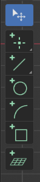

Tools in CAD Sketcher are either exposed as a workspacetool or as an operator. Note however
that either of those use the same [interaction system](interaction_system.md).

## Generic Tools
::: CAD_Sketcher.operators.add_sketch.View3D_OT_slvs_add_sketch

::: CAD_Sketcher.operators.delete_entity.View3D_OT_slvs_delete_entity

::: CAD_Sketcher.operators.delete_constraint.View3D_OT_slvs_delete_constraint

## Workspacetools
{style="height:160px; width:60px; object-fit:cover;" align=right}

Workspacetools are used to interactively create entities. You can access them from
the viewport's "T"-panel. Check the [tools section](tools.md) to get familiar with
the behavior of CAD Sketcher tools.

> **INFO:** Interaction with extension geometry is only possible when one of the
extension tools is active.

### Workspacetool Access Keymap
Whenever one of the extension's tools is active the tool access keymap allows to quickly switch between the different tools.

|Key|Modifier|Action|
|:---:|---|---|
|Esc / Rmb|-   |Activate Tool: Select|
|P|-   |Invoke Tool: Add Point 2D|
|L|-   |Invoke Tool: Add Line 2D|
|C|-   |Invoke Tool: Add Circle|
|A|-   |Invoke Tool: Add Arc|
|R|-   |Invoke Tool: Add Rectangle|
|Y|-   |Invoke Tool: Trim|
|B|-   |Invoke Tool: Bevel|
|O|-   |Invoke Tool: Offset|
|S|-   |Invoke Tool: Add Sketch|

**Dimensional Constraints:**

|Key|Modifier|Action|
|---|---|---|
|D|Alt   |Distance|
|V|Alt   |Vertical Distance|
|H|Alt   |Horizontal Distance|
|A|Alt   |Angle|
|O|Alt   |Diameter|
|R|Alt   |Radius|

**Geometric Constraints:**

|Key|Modifier|Action|
|---|---|---|
|C|Shift   |Coincident|
|V|Shift   |Vertical|
|H|Shift   |Horizontal|
|E|Shift   |Equal|
|A|Shift   |Parallel|
|P|Shift   |Perpendicular|
|T|Shift   |Tangent|
|M|Shift   |Midpoint|
|R|Shift   |Ratio|

### Editing Keymap
Available while any of the extension's tools is active.

|Key|Modifier|Action|
|:---:|---|---|
|X / Del|-|Delete selected entities|
|C|Ctrl|Copy|
|V|Ctrl|Paste|
|D|Shift|Duplicate & move|
|G|-|Move|
|V|-|Align view to the active entity|
|M|Alt|Merge points|
|C|Alt+Shift|Toggle construction mode|

### Global Shortcuts
Available in Object Mode regardless of the active tool.

|Key|Modifier|Action|
|:---:|---|---|
|A|Ctrl+Shift|Add sketch / leave the active sketch|
|E|Ctrl+Shift|Extrude the active sketch|
|D|Ctrl+Shift|Linear array of the active sketch|
|Esc|Shift|Switch to Blender's Select tool|

### Basic Tool Keymap
The basic tool interaction is consistent between tools.

|Key|Modifier|Action|
|:---:|---|---|
|Tab|-|Jump to next tool state or property substate when in numerical edit|
|0-9 / (-)|-|Activate numeric edit|
|Enter / Lmb|-|Verify the operation|
|Esc / Rmb|-|Cancel the operation|

**While numeric edit is active**

|Key|Modifier|Action|
|:---:|---|---|
|Tab|-|Jump to next tool property substate|
|0-9|-|Activate numeric edit|
|Minus(-)|-|Toggle between positive and negative values|

### Selection tools
::: CAD_Sketcher.operators.select.View3D_OT_slvs_select

::: CAD_Sketcher.operators.select.View3D_OT_slvs_select_all

::: CAD_Sketcher.operators.select.View3D_OT_slvs_select_invert

::: CAD_Sketcher.operators.select.View3D_OT_slvs_select_extend

::: CAD_Sketcher.operators.select.View3D_OT_slvs_select_extend_all

**Keymap:**

|Key|Modifier|Action|
|---|---|---|
|LMB (click)|-   |Toggle select|
|LMB (click)|Shift|Extend selection|
|LMB (click)|Ctrl|Subtract from selection|
|LMB (drag)|-|Box select, or tweak the hovered entity|
|LMB (drag)|Shift|Box select (extend)|
|LMB (drag)|Ctrl|Box select (subtract)|
|A|Ctrl|Select all|
|Esc|-   |Deselect all|
|I|Ctrl |Invert selection|
|E|Ctrl |Extend selection in chain|
|E|Ctrl+Shift   |Select full chain|
|Rmb|-|Open the context menu|

> **INFO:** LMB in empty space will also deselect all.

> **INFO:** Chain selection works with coincident constraints too

::: CAD_Sketcher.operators.add_point_2d.View3D_OT_slvs_add_point2d

::: CAD_Sketcher.operators.add_line_2d.View3D_OT_slvs_add_line2d

::: CAD_Sketcher.operators.add_circle.View3D_OT_slvs_add_circle2d

::: CAD_Sketcher.operators.add_arc.View3D_OT_slvs_add_arc2d

::: CAD_Sketcher.operators.add_rectangle.View3D_OT_slvs_add_rectangle

::: CAD_Sketcher.operators.trim.View3D_OT_slvs_trim

### Workplane tools
A workplane is any Blender object whose transform defines the sketch plane (see
[code documentation](code_docs.md)). These operators manage the workplane an
active sketch is anchored to.

::: CAD_Sketcher.operators.align_workplane.View3D_OT_slvs_align_workplane_cursor

::: CAD_Sketcher.operators.workplane_anchor.View3D_OT_slvs_make_workplane_free

::: CAD_Sketcher.operators.workplane_anchor.View3D_OT_slvs_reattach_workplane
