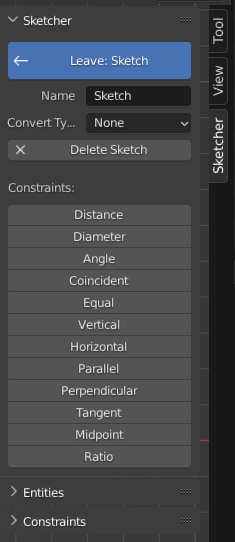
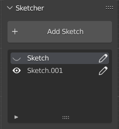
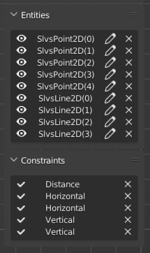
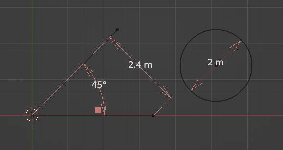
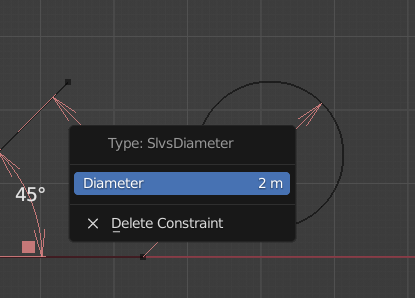
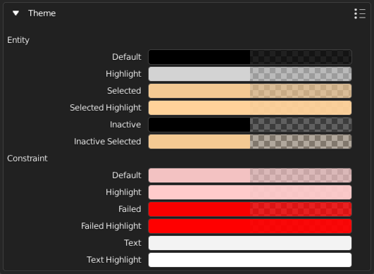
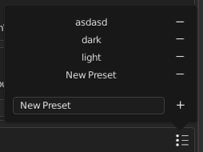

## Sidebar
{style="width:200px; height:220px; object-fit:cover;" align=right}

The extension adds a some panels to the "N"-sidebar under the category "Sketcher". From
here you can set the active sketch, access its properties, add constraints and
interact with elements via the browsers.
{style="display:block; height:220px"}


### Sketch Selector
{align=right style="width:200px;"}

Whenever no sketch is active the sidebar will list all available sketches, scoped
to the [part](parts.md) you have selected. From there you can set one as active
or toggle its visibility: since a sketch is pure source and stays hidden, the eye
toggles the body it is realised on, which is what stands for it on screen. The UI
will change when a sketch is active, showing a big blue button which lets you exit
the sketch as well as some properties of that sketch and the workplane it sits on.
{style="display:block; height:220px"}

### Tools Panel
Holds what acts on the sketch as a whole rather than on one element: Merge Points,
Project Geometry and the buttons that add constraints. Outside a sketch it offers
[Make Part and Add Assembly](parts.md) instead.

The constraint buttons come in two layouts, switched with the icon on the right of
the "Constraints" header: a compact **icon grid** (the default) or a list with the
constraint names. Either way dimensional constraints are kept separate from
geometric ones, and only the constraints that apply to the current sketch mode are
offered.

### Entity Browser
{align=right style="width:200px"}

Lists all currently [active entities](entities.md#active), with an icon per type.
Allows selection by clicking on the name.

### Constraint Browser
Lists all currently [active constraints](constraints.md#active), split into
dimensional and geometric. A dimensional constraint shows its value as an editable
field, a failing constraint is marked on the right, and each row leads to the
constraint's context menu. "Show All" and "Hide All" at the top toggle the
constraint gizmos of the sketch at once.
{style="display:block; height:200px"}

## Gizmos
Gizmos are used to display constraints. There are specific gizmo
types for the three dimensional constraints, angle, distance and diameter.

To interact with the settings of a constraint click its gizmo to open a menu.
{align=left style="height:300px; width:calc(65% - 1em); object-fit:cover;"}
{align=right style="height:300px; width:calc(35% - 1em); object-fit:cover;"}

The rest of the constraints use a generic gizmo that is displayed next to the entities
they depend on. Clicking such a gizmo either shows the constraint's settings or directly
deletes the constraint if it has no settings to show.

Icons that sit on the same element, or that would overlap on screen, are drawn as
one icon with a count; hover it to expand the group and reach the individual
constraints. Turn that off with "Group Constraint Icons" in the preferences.

<!-- TODO: image -->


## Context Menu
The context menu can be used to access properties and actions of an element, either
by hovering an entity and pressing the right mouse button, by clicking a constraint
gizmo that supports it or through the corresponding button in one of the element browsers.

> **INFO:** Only the hovered entity is used, the context menu ignores the selection.

## Preferences
Access the preferences by expanding the enabled extension under
Edit > Preferences > Add-ons > CAD Sketcher.

{align=left style="height:300px; width:calc(50% - 1em); object-fit:cover;"}
{align=right style="height:300px; width:calc(50% - 1em); object-fit:cover;"}

### Interface
Everything about how the extension draws and behaves in the viewport: fading
objects that aren't being sketched on, aligning the view to the active entity,
the size of entities, workplanes, constraint icons, text and arrows, and whether
constraint icons that sit on the same element are grouped into one.

### Geometry
- **Curve Resolution** &mdash; the largest angle per edge used when arcs and
  circles are meshed. It is the default for new sketches; each one keeps its own
  value on its Convert modifier, see [integration](integration.md).
- **Boolean Solver** &mdash; the solver new booleans use, Exact or the faster
  Manifold. It can be changed per boolean afterwards.

### Units
The precision used to display values: decimals for metric, fractions for
imperial, and decimals for angles.

### Advanced
- Whether the "What's New" dialog is shown after the extension updates.
- By enabling "Show Debug Settings" some experimental features are enabled, use
  with caution.
- Choose the logging settings.

### Theme
{align=right}

Colors that are used in the extension are defined under the theme section. The extension also
supports theme presets, including a light preset for light viewports. You can get the presets path by entering the following line into blenders python console:

``` py
bpy.utils.user_resource("SCRIPTS")
```
